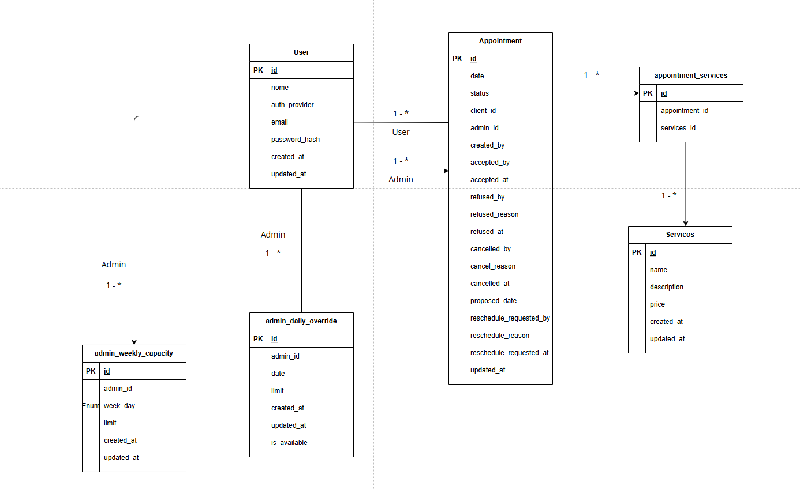

# Appointment  API

API para gerenciamento de agendamentos de serviços de informática, permitindo que
clientes realizem agendamentos com base na disponibilidade de administradores
responsáveis pela execução dos serviços.

O projeto foi desenvolvido utilizando **FastAPI**, **PostgreSQL** e **SQLAlchemy**.

## 📌 Visão Geral

A aplicação permite:

- Cadastro e autenticação de usuários (admin e cliente)
- Serviços disponíveis
- Cadastro de disponibilidade de administradores
- Agendamento de serviços
- Associação de múltiplos serviços a um mesmo agendamento
- Notificações por e-mail (cadastro, agendamento e lembretes)

## 🧱 Arquitetura

O projeto segue uma arquitetura em camadas (Layered Architecture) com separação clara de responsabilidades:

- **Routers**: Endpoints da API, validação de entrada
- **Services**: Lógica de negócio e orquestração
- **Repositories**: Acesso a dados, queries SQLAlchemy
- **Models**: Entidades do banco de dados (ORM)
- **Schemas**: Validação e serialização de dados (Pydantic)
- **Dependencies**: Injeção de dependências do FastAPI
- **Core**: Configurações, segurança, exceções e utilitários

## 🧩 Modelagem de Dados



O diagrama acima representa a base da modelagem relacional da aplicação. A estrutura
é centrada no fluxo de agendamento, conectando clientes, administradores e os
serviços associados a cada atendimento.

Principais entidades e relacionamentos:

- **User**: representa clientes e administradores, reunindo dados de identificação,
  autenticação local ou via Google e informações de auditoria.
- **Appointment**: concentra o ciclo completo do agendamento, incluindo cliente,
  administrador, status, criação, aceite, recusa, cancelamento e proposta de
  reagendamento.
- **Servicos**: armazena o catálogo de serviços disponíveis, com nome, descrição,
  preço e dados de auditoria.
- **appointment_services**: tabela de associação entre agendamentos e serviços,
  permitindo que um atendimento contenha múltiplos serviços.
- **admin_weekly_capacity**: define a capacidade recorrente do administrador por
  dia da semana.
- **admin_daily_override**: permite sobrescrever a disponibilidade de um
  administrador em uma data específica, inclusive marcando indisponibilidade.

Em termos de cardinalidade, um usuário pode atuar como cliente em vários
agendamentos e também como administrador em vários atendimentos. Cada agendamento
pode conter um ou mais serviços por meio da tabela `appointment_services`. Além
disso, a disponibilidade operacional dos administradores é modelada em dois níveis:
uma capacidade semanal padrão em `admin_weekly_capacity` e ajustes pontuais por
data em `admin_daily_override`.

## 🔐 Autenticação e Autorização

- Autenticação baseada em JWT

- Login via e-mail e senha

- Login social com Google

- Controle de acesso baseado em role (admin | user)

- Tokens assinados e com tempo de expiração

## 🚀 Como Rodar o Projeto

- Pré-requisitos

  - Docker e Docker Compose

  - Python 3.11+

- Subindo banco de dados

    ```bash
    docker-compose up -d

    ```

- Criando ambiente virtual

    ```bash
    python -m venv .venv
    source .venv/bin/activate
    ```

- Sicronizando as dependencias

    ```bash
    uv sync
    ```

- Rodando a aplicação

    ```bash
    task run
    ```

- A API estará disponível em: <http://localhost:8000/docs>

## 🗂 Estrutura de Pastas

```text
src/
├── app.py                    # Aplicação FastAPI principal
├── core/                     # Configurações e utilitários centrais
│   ├── db/
│   │   ├── base.py          # Base do SQLAlchemy
│   │   ├── dependencies.py  # Dependências do banco
│   │   └── session.py        # Configuração de sessão
│   ├── exceptions/
│   │   ├── base_exception.py
│   │   ├── error_handlers.py
│   │   ├── appointment_exception.py
│   │   ├── services_exception.py
│   │   └── user_exception.py
│   ├── logging_config.py
│   ├── security.py           # JWT e hash de senhas
│   └── settings.py           # Configurações da aplicação
│
├── dependencies/             # Dependências do FastAPI
│   ├── auth_dependencies.py
│   └── pagination_dependencies.py
│
├── enums/
│   ├── user_role.py
│   ├── appointment_status.py
│   ├── appointment_weekday.py
│   └── date_filter.py
│
├── models/                   # Modelos SQLAlchemy (ORM)
│   ├── user_model.py
│   ├── service_model.py
│   ├── appointment_model.py
│   ├── appointment_service_model.py
│   └── admin_daily_limit_model.py
│
├── repositories/            # Camada de acesso a dados
│   ├── interfaces/
│   │   ├── user_interface.py
│   │   ├── services_interface.py
│   │   └── appointments_interface.py
│   ├── user_repository.py
│   ├── services_repository.py
│   └── appointments_repository.py
│
├── routers/                 # Rotas/Endpoints da API
│   ├── user_router.py
│   ├── services_router.py
│   └── appointments_router.py
│
├── schemas/                 # Schemas Pydantic (validação)
│   ├── user_schema.py
│   ├── services_schema.py
│   ├── appointments_schema.py
│   └── token_schema.py
│
├── services/                # Lógica de negócio
│   ├── auth_service.py
│   ├── user_service.py
│   ├── services_service.py
│   └── appointments_service.py
│
├── templates/               # Templates de email
│   └── emails/
│       └── welcome.html     # Template de email de boas-vindas
│
└── utils/                   # Utilitários
    └── date_filters.py
```

**Fluxo de dados:** `Router → Service → Repository → Model`

## 📡 Endpoints da API

### Usuários (`/users`)
- `POST /users/` - Criar usuário (público)
- `POST /users/login` - Login e obter token JWT (público)
- `GET /users/me` - Obter dados do usuário autenticado
- `PUT /users/{id}` - Atualizar usuário
- `DELETE /users/{id}` - Deletar usuário
- `GET /users/detail/{id}` - Obter usuário por ID (admin)
- `GET /users/` - Listar clientes com filtros (admin)

### Serviços (`/services`)
- `GET /services/` - Listar todos os serviços (autenticado)
- `GET /services/{id}` - Obter serviço por ID (admin)
- `POST /services/` - Criar serviço (admin)
- `PUT /services/{id}` - Atualizar serviço (admin)
- `DELETE /services/{id}` - Deletar serviço (admin)

### Agendamentos (`/appointments`)
- `POST /appointments/` - Criar agendamento (cliente)
- `GET /appointments/` - Listar agendamentos com filtros (cliente/admin)
- `GET /appointments/{id}` - Obter agendamento por ID
- `PUT /appointments/{id}` - Atualizar agendamento (cliente, apenas PENDING)
- `POST /appointments/{id}/cancel` - Cancelar agendamento (cliente/admin)
- `POST /appointments/{id}/confirm` - Confirmar agendamento (admin)
- `DELETE /appointments/{id}` - Deletar agendamento (admin)

## 🧪 Testes
